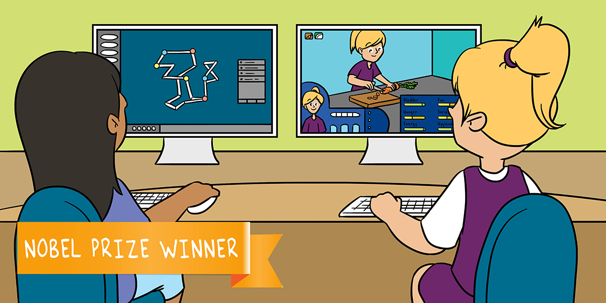

# شبیه‌سازی‌های کامپیوتری در خدمت زیست‌شناسی  
نویسنده: مایکل لویت

منتقدان جوان: ناتان آلترمن

<h2>  چکیده </h2>
شبیه‌سازی کامپیوتری یک ابزار مهم تحقیقاتی در دنیای علمی امروز است. رایانه‌ها به ما اجازه می‌دهند محاسباتی را انجام دهیم که رفتار سیستم‌های پیچیده (بیولوژیکی) را به شیوه‌ای تقلید می‌کند که در غیر این صورت نمی‌توانستیم به آن برسیم. شما می‌توانید این شبیه‌سازی‌ها را یک بازی رایانه‌ای در نظر بگیرید که در آن یک دنیای مجازی ایجاد می‌شود که طبق قوانین خاصی (به عنوان مثال قوانین فیزیک) کار می‌کند. در حالی که ما بازی را انجام می‌دهیم، قوانین حاکم بر این دنیای مجازی و محیط آن و همچنین نحوه تأثیرگذاری ما بر روی این جهان به عنوان بازیکنان را می‌آموزیم. در این مقاله، من نحوه استفاده از شبیه‌سازی‌های کامپیوتری در دنیای زیست شناسی ساختاری برای مطالعه ساختار و عملکرد مولکول‌ها را توضیح خواهم داد. من همچنین توضیح خواهم داد که چگونه می‌توانم از بینش‌های دنیای زیست‌شناسی و شبیه‌سازی‌های کامپیوتری برای پیشبرد جامعه‌ای که در آن زندگی می‌کنیم استفاده کنیم.

پروفسور لویت جایزه نوبل شیمی را در سال ۲۰۱۳ برای توسعه مدل های چند مقیاس برای سیستم های شیمیایی پیچیده دریافت کرد.

## شبیه سازی کامپیوتری چیست؟
یک راه ساده برای درک شبیه سازی رایانه ای ابزاری برای انجام مطالعات علمی بر اساس محاسبات با استفاده از رایانه. شما می توانید شبیه سازی های رایانه ای مانند بازی های رایانه ای را در نظر بگیرید که به دانشمندان کمک می کند تا پدیده هایی را که مورد بررسی قرار می دهند ، بهتر بیاموزند. این است که به بازی های رایانه ای فکر کنید. به عنوان مثال ، در مورد یک بازی ماجراجویی فکر کنید ، که در آن شخصیت شما در حال انجام کارهای مختلف در محیطی قدم می زند. برای اینکه بازی واقعی به نظر برسد ، کامپیوتر باید یک دنیای مجازی بسازد که مانند دنیای واقعی رفتار کند. به عنوان مثال ، اگر شما یک توپ را در طول بازی پرتاب کنید ، کامپیوتر باید از معادله فیزیکی مناسب (معادله حرکت نیوتن ، در این مورد) برای محاسبه حرکت توپ و ایجاد یک شبیه سازی واقع بینانه از مسیر فیزیکی استفاده کند. توپ در حین حرکت خود (شکل 1). با همان اصل ، رایانه می تواند سایر فرایندهای واقعی را شبیه سازی کند ، با این فرض که قوانین فیزیکی حاکم بر آنها را می دانیم. به عبارت دیگر ، نه تنها قوانین حاکم بر حرکت اجسام را می توان شبیه سازی کرد ، همانطور که در مثال بالا مشاهده کردیم ، بلکه فرآیندهای پیچیده تری مانند آب و هوا ، واکنش های شیمیایی و همچنین انواع فرآیندهای بیولوژیکی مانند مولکولهای بیولوژیکی بزرگ که تمام عملکردهای زندگی را انجام می دهند - بدن را می سازند ، در واکنشهای شیمیایی شرکت می کنند ، غذا را هضم می کنند و غیره. شما می توانید پروتئین ها را به عنوان گردنبندی در نظر بگیرید که از انواع مختلف مهره تشکیل شده است و به شکلهای سه بعدی منحصر به فرد جمع می شوند ، به طوری که هر پروتئین دارای شکل تا شده منحصر به فرد خود است. که در زیر به آن می پردازیم.

<!-- 

<a href="#">VIEW THE BLOG</a>

 -->

